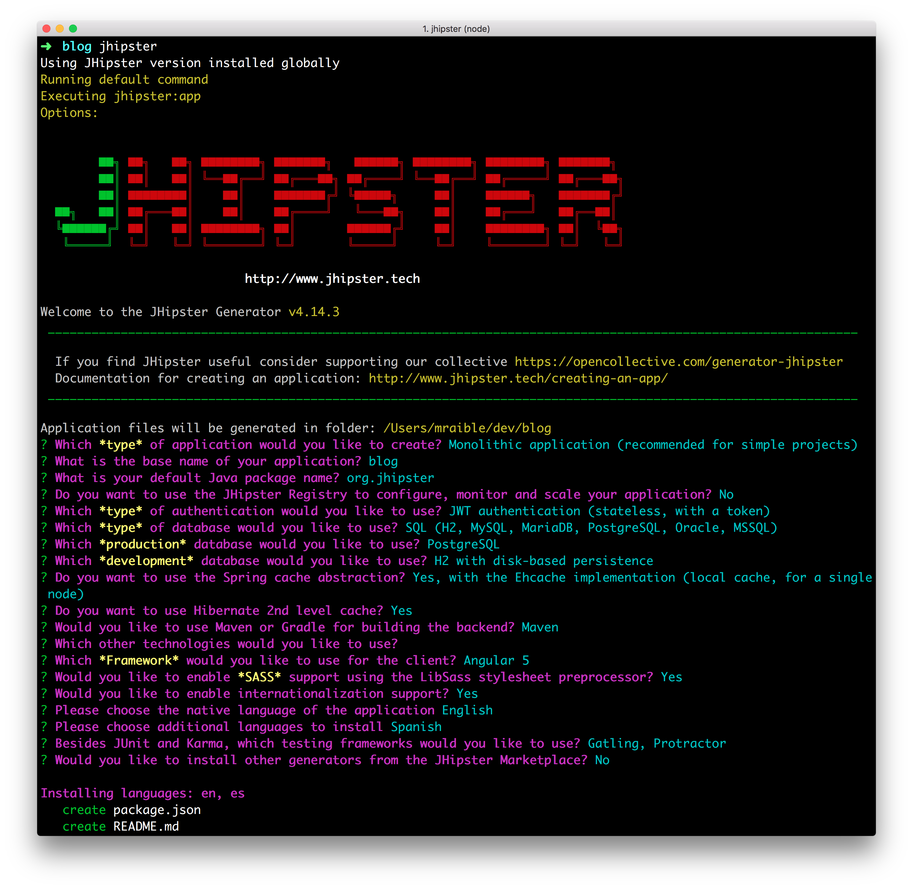
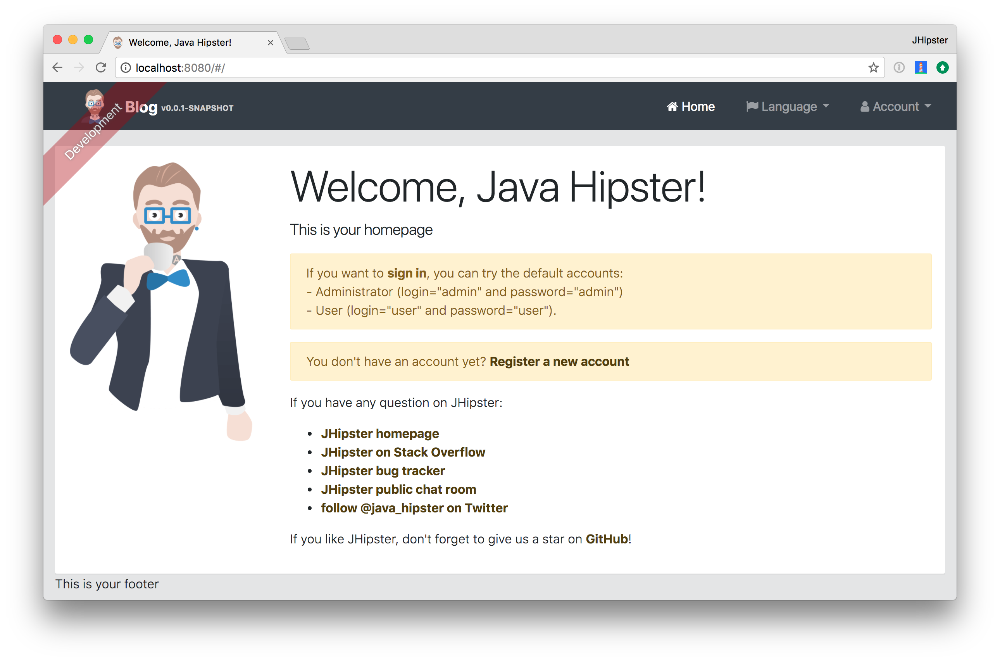
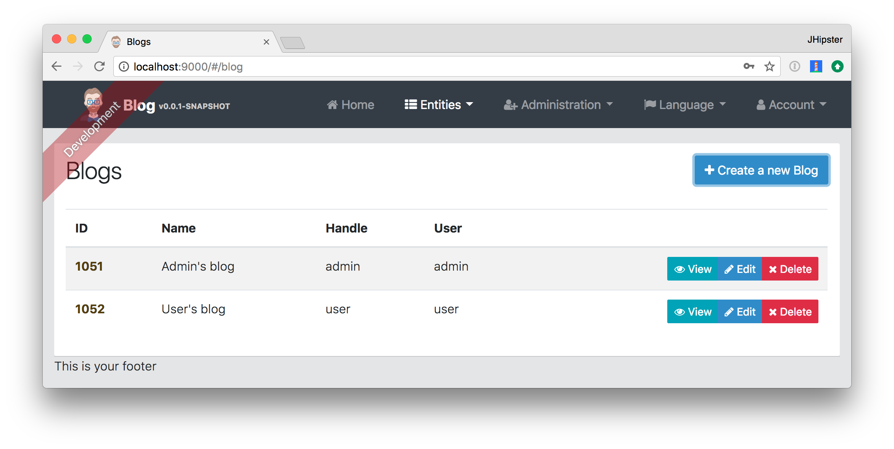
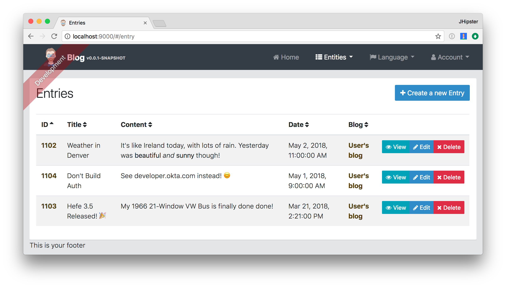
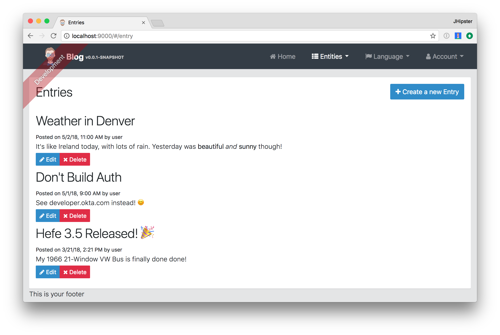

= Get Started with JHipster 4
:author: Matt Raible
:email:  matt@raibledesigns.com
:revnumber: 1.1
:revdate:   {docdate}
:subject: JHipster
:keywords: JHipster, Angular, Spring Boot, Bootstrap 4
:icons: font
:lang: en
:language: javadocript
:sourcedir: .
ifndef::env-github[]
:icons: font
endif::[]
ifdef::env-github,env-browser[]
:toc: preamble
:toclevels: 2
endif::[]
ifdef::env-github[]
:status:
:outfilesuffix: .adoc
:!toc-title:
:caution-caption: :fire:
:important-caption: :exclamation:
:note-caption: :paperclip:
:tip-caption: :bulb:
:warning-caption: :warning:
endif::[]
:toc:

This article shows you how to build a simple blog application with https://jhipster.github.io/2017/03/01/jhipster-release-4.0.7.html[JHipster 4.0.7].

ifdef::env-github[]
TIP: It appears you're reading this document on GitHub. If you want a prettier view, install https://chrome.google.com/webstore/detail/asciidoctorjs-live-previe/iaalpfgpbocpdfblpnhhgllgbdbchmia[Asciidoctor.js Live Preview for Chrome], then view the https://raw.githubusercontent.com/mraible/jhipster4-demo/master/README.adoc[raw document]. Another option is to use the http://gist.asciidoctor.org/?github-mraible/jhipster4-demo//README.adoc[DocGist view].
endif::[]

.Source Code
****
If you'd like to get right to it, the https://github.com/mraible/jhipster4-demo[source for this application is on GitHub]. To run the app, use `./mvnw`. To test it, run `./mvnw test`. To run its integration tests, run `./mvnw` in one terminal and `yarn run e2e` in another.
****

== What is JHipster?

JHipster is one of those open-source projects you stumble upon and immediately think, "`Of course!`" It combines three very successful frameworks in web development: Bootstrap, Angular, and Spring Boot. Bootstrap was one of the first dominant web-component frameworks. Its largest appeal was that it only required a bit of HTML and it worked! All the efforts we made in the Java community to develop web components were shown a better path by Bootstrap. It leveled the playing field in HTML/CSS development, much like Apple's Human Interface Guidelines did for iOS apps.

JHipster was started by Julien Dubois in October 2013 (Julien's first commit was on https://github.com/jhipster/generator-jhipster/commit/c8630ab7af7b6a99db880b3b0e2403806b7d2436[October 21, 2013]). The first public release (version 0.3.1) was launched December 7, 2013. Since then, the project has had over 115 releases! It is an open-source, Apache 2.0-licensed project on GitHub. It has a core team of 16 developers and over 280 contributors. You can find its homepage at http://jhipster.github.io/[http://jhipster.github.io]. If you look at https://github.com/jhipster/generator-jhipster[the project on GitHub], you can see it's mostly written in JavaScript (42%) and Java (27%).

At its core, JHipster is a http://yeoman.io/[Yeoman] generator. Yeoman is a code generator that you run with a `yo` command to generate complete applications or useful pieces of an application. Yeoman generators promote what the Yeoman team calls the "`Yeoman workflow`". This is an opinionated client-side stack of tools that can help developers quickly build beautiful web applications. It takes care of providing everything needed to get working without the normal pains associated with a manual setup.

JHipster 4 is the same JHipster many developers know and love, with a couple bright and shiny new features: namely Angular and Bootstrap 4 support.

NOTE: When I say "AngularJS", I mean Angular 1.x. "Angular" is the forward-looking name for Angular 2 and beyond.

== Install JHipster 4

The http://jhipster.github.io/installation/[Installing JHipster] instructions show you all the tools you'll need to use a released version of JHipster.

. Install Java 8 http://www.oracle.com/technetwork/java/javase/downloads/index.html[from Oracle].
. Install Git from https://git-scm.com.
. Install Node.js from http://nodejs.org. I used Node 6.9.1 to write this article.
. Install Yarn using the https://yarnpkg.com/en/docs/install[Yarn installation instructions].
. Run the following command to install http://yeoman.io/[Yeoman].

    yarn global add yo

. Run the following command to install JHipster.

    yarn global add generator-jhipster

== Create a Project

To create a project, open a terminal window and create a directory. For example, `mdkdir blog`. Navigate into the directory and run `yo jhipster`. You'll be asked a number of questions about the type of application you want to create and what features you'd like to include. The screenshot below shows the choices I made to create a simple blog application with Angular.

.Generating the application

If you'd like to create the same application I did, you can place the following `.yo-rc.json` file in an empty directory and run `yo jhipster` in it. You won't be prompted to answer any questions because the answers are already in `.yo-rc.json`.

[source,json]
----
{
  "generator-jhipster": {
    "jhipsterVersion": "4.0.5",
    "baseName": "blog",
    "packageName": "org.jhipster",
    "packageFolder": "org/jhipster",
    "serverPort": "8080",
    "authenticationType": "jwt",
    "hibernateCache": "ehcache",
    "clusteredHttpSession": false,
    "websocket": false,
    "databaseType": "sql",
    "devDatabaseType": "h2Disk",
    "prodDatabaseType": "mysql",
    "searchEngine": false,
    "messageBroker": false,
    "serviceDiscoveryType": false,
    "buildTool": "maven",
    "enableSocialSignIn": false,
    "jwtSecretKey": "a895eda190e4ddf6eba453aa725bb4da8a565dfc",
    "clientFramework": "angular2",
    "useSass": true,
    "clientPackageManager": "yarn",
    "applicationType": "monolith",
    "testFrameworks": [
      "gatling",
      "protractor"
    ],
    "jhiPrefix": "jhi",
    "enableTranslation": true,
    "nativeLanguage": "en",
    "languages": [
      "en",
      "es"
    ]
  }
}
----

The project creation process will take a couple minutes to run, depending on your internet connection speed. When it's finished, you should see output like the following.

.Generation success
image::static/generation-success.png[Generation success, 1082, scaledwidth=100%]

Run `./mvnw` to start the application and navigate to http://localhost:8080 in your favorite browser. The first thing you'll notice is a dapper-looking fellow explaining how you can sign in or register.

.Default homepage

Sign in with username `admin` and password `admin` and you'll have access to navigate through the Administration section. This section offers nice looking UIs on top of some Spring Boot's many monitoring and configuration features. It also allows you to administer users:

.User management

It gives you insights into Application and JVM metrics:

.Application metrics
image::static/app-metrics.png[Application and JVM Metrics, 1367, scaledwidth=100%]

And it allows you to see the Swagger docs associated with its API.

.Swagger docs
image::static/swagger-docs.png[Swagger docs, 1367, scaledwidth=100%]

You can run the following command (in a separate terminal window) to run the Protractor tests and confirm everything is working properly.

----
yarn e2e
----

At this point, it's a good idea to check your project into Git so you can easily see what changes are made going forward.

----
git init
git add .
git commit -m "Project created"
----

== Generate Entities

For each entity you want to create, you will need:

* a database table;
* a Liquibase change set;
* a JPA entity class;
* a Spring Data `JpaRepository` interface;
* a Spring MVC `RestController` class;
* an Angular model, state, component, dialog components, service; and
* several HTML pages for each component.

In addition, you should have integration tests to verify that everything works and performance tests to verify that it runs fast. In an ideal world, you'd also have unit tests and integration tests for your Angular code.

The good news is JHipster can generate all of this code for you, including integration tests and performance tests. In addition, if you have entities with relationships, it will generate the necessary schema to support them (with foreign keys), and the TypeScript and HTML code to manage them. You can also set up validation to require certain fields as well as control their length.

JHipster supports several methods of code generation. The first uses its https://jhipster.github.io/creating-an-entity/[entity sub-generator]. The entity sub-generator is a command-line tool that prompts you with questions which you answer. https://jhipster.github.io/jdl-studio/[JDL-Studio] is a browser-based tool for defining your domain model with JHipster Domain Language (JDL). Finally, https://jhipster.github.io/jhipster-uml/[JHipster-UML] is an option for those that like UML. Supported UML editors include https://www.modeliosoft.com/[Modelio], http://www.umldesigner.org/[UML Designer], https://www.genmymodel.com/[GenMyModel] and http://www.visual-paradigm.com/[Visual Paradigm]. I like the visual nature of JDL-Studio, so I'll use it for this project.

Below is the entity diagram and JDL code needed to generate a simple blog with blogs, entries and tags.

.Blog entity diagram

You can http://bit.ly/jhipster4-blog-jdl[click on this URL], or copy/paste the contents of the file below to your hard drive if you'd like to follow along.

.jhipster-jdl.jh
----
entity Blog {
	name String required minlength(3),
	handle String required minlength(2)
}

entity Entry {
	title String required,
	content TextBlob required,
	date ZonedDateTime required
}

entity Tag {
	name String required minlength(2)
}

relationship ManyToOne {
	Blog{user(login)} to User,
	Entry{blog(name)} to Blog
}

relationship ManyToMany {
	Entry{tag(name)} to Tag{entry}
}

paginate Entry, Tag with infinite-scroll
----

Run the following command (in the `blog` directory) to import this file and generate entities, tests and a UI.

----
yo jhipster:import-jdl ~/Downloads/jhipster-jdl.jh
----

You'll be prompted to overwrite `src/main/resources/config/liquibase/master.xml`. Type `a` to overwrite this file, as well as others.

Restart the application with `/.mvnw` and run `yarn start` to view the UI for the generated entities. Create a couple blogs for the existing `admin` and `user` users, as well as a few blog entries.

.Blogs

.Entries

From these screenshots, you can see that users can see each other's data, and modify it.

Check your generated entities into Git.

----
git init
git add .
git commit -m "Entities generated"
----

== Add Business Logic

TIP: To configure an IDE with your JHipster project, see https://jhipster.github.io/configuring-ide/[Configuring your IDE]. Instructions exist for Eclipse, IntelliJ IDEA, Visual Studio Code, and NetBeans.

To add more security around blogs and entries, open `BlogResource.java` and find the `getAllBlogs()` method. Change the following line:

[source,java]
.src/main/java/org/jhipster/web/rest/BlogResource.java
----
List<Blog> blogs = blogRepository.findAll();
----

To:

[source,java]
.src/main/java/org/jhipster/web/rest/BlogResource.java
----
List<Blog> blogs = blogRepository.findByUserIsCurrentUser();
----

The `findByUserIsCurrentUser()` method is generated by JHipster in the `BlogRespository` class and allows limiting results by the current user.

[source,java]
.src/main/java/org/jhipster/repository/BlogRepository.java
----
public interface BlogRepository extends JpaRepository<Blog,Long> {

    @Query("select blog from Blog blog where blog.user.login = ?#{principal.username}")
    List<Blog> findByUserIsCurrentUser();

}
----

After making this change, re-compiling `BlogResource` should trigger a restart of the application thanks to http://docs.spring.io/spring-boot/docs/current/reference/html/using-boot-devtools.html[Spring Boot's Developer tools]. If you navigate to http://localhost:9000/blogs, you should only see the blog for the current user.

.Admin's blog

To add this same logic for entries, open `EntryResource.java` and find the `getAllEntries()` method. Change the following line:

[source,java]
.src/main/java/org/jhipster/web/rest/EntryResource.java
----
Page<Entry> page = entryRepository.findAll(pageable);
----

To:

[source,java]
.src/main/java/org/jhipster/web/rest/EntryResource.java
----
Page<Entry> page = entryRepository.findByBlogUserLoginOrderByDateDesc(SecurityUtils.getCurrentUserLogin(), pageable);
----

Using your IDE, create this method in the `EntryRepository` class. It should look as follows:

[source,java]
.src/main/java/org/jhipster/repository/EntryRepository.java
----
Page<Entry> findByBlogUserLoginOrderByDateDesc(String currentUserLogin, Pageable pageable);
----

Recompile both changed classes and verify that the `user` user only sees the entries you created for them.

.User's entries

After making this changes, commit them to Git.

----
git add .
git commit -m "Add business logic"
----

You might notice that this application doesn't look like a blog and it doesn't allow HTML in the content field.

== Make UI Enhancements

When doing UI development on a JHipster-generated application, it's nice to see your changes as soon as you save a file. JHipster 4 uses https://www.browsersync.io/[Browsersync] and https://webpack.github.io/[webpack] to power this feature. You enable this previously by running the following command in the `blog` directory.

----
yarn start
----

In this section, you'll change the following:

. Change the rendered content field to display HTML
. Change the list of entries to look like a blog

==== Allow HTML

If you enter HTML in the `content` field of a blog entry, you'll notice it's escaped on the list screen.

.Escaped HTML

To change this behavior, open `entry.component.html` and change the following line:

[source,html]
.src/main/webapp/app/entities/entry/entry.component.html
----
<td>{{entry.content}}</td>
----

To:

[source,html]
.src/main/webapp/app/entities/entry/entry.component.html
----
<td [innerHTML]="entry.content"></td>
----

After making this change, you'll see that the HTML is no longer escaped.

.HTML in entries

==== Improve the layout

To make the list of entries look like a blog, replace `
` with HTML so it uses a stacked layout in a single column.

[source,html]
.src/main/webapp/app/entities/entry/entry.component.html
----

    
= links['last']" [infiniteScrollDistance]="0">
        

            <h2>{{entry.title}}</h2>
            <small>Posted on {{entry.date | date: 'short'}} by {{entry.blog.user.login}}</small>
            

            

                <button type="submit"
                        [routerLink]="['/', { outlets: { popup: 'entry/'+ entry.id + '/edit'} }]"
                        replaceUrl="true"
                        class="btn btn-primary btn-sm">
                    
                    Edit
                </button>
                <button type="submit"
                        [routerLink]="['/', { outlets: { popup: 'entry/'+ entry.id + '/delete'} }]"
                        replaceUrl="true"
                        class="btn btn-danger btn-sm">
                    
                    Delete
                </button>
            

        

    

----

Now it looks more like a regular blog!

.Blog entries

Commit all your changes to Git.

----
git add .
git commit -m "UI enhancements"
----

== Deploy to the Cloud

A JHipster application can be deployed anywhere a Spring Boot application can be deployed.

JHipster ships with support for deploying to https://jhipster.github.io/cloudfoundry/[Cloud Foundry], https://jhipster.github.io/heroku/[Heroku], https://jhipster.github.io/kubernetes/[Kubernetes], https://jhipster.github.io/aws/[AWS], and https://jhipster.github.io/boxfuse/[AWS with Boxfuse]. I'm using Heroku in this example because it doesn't cost me anything to host it.

When you prepare a JHipster application for
production, it's recommended to use the pre-configured "`production`" profile. With Maven, you can package your
application by specifying the `prod` profile when building.

----
mvn -Pprod package
----

The production profile is used to build an optimized JavaScript client. You can invoke this using webpack by running `yarn run webpack:prod`.
The production profile also configures gzip compression with a servlet filter, cache headers, and monitoring via
https://github.com/dropwizard/metrics[Metrics]. If you have a http://graphite.wikidot.com/[Graphite] server configured in
your `application-prod.yaml` file, your application will automatically send metrics data to it.

When you run this command, you'll likely get a test failure.

----
Results :

Tests in error:
  BlogResourceIntTest.getAllBlogs:171 » NestedServlet Request processing failed;...

Tests run: 62, Failures: 0, Errors: 1, Skipped: 0
----

The reason this happens is shown in a stack trace in your terminal

----
getAllBlogs(org.jhipster.web.rest.BlogResourceIntTest)  Time elapsed: 0.041 sec  <<< ERROR!
org.springframework.web.util.NestedServletException: Request processing failed; nested exception is
org.springframework.dao.InvalidDataAccessApiUsageException: Authentication object cannot be null;
nested exception is java.lang.IllegalArgumentException: Authentication object cannot be null
----

To fix this, you can use Spring Security Test's http://docs.spring.io/spring-security/site/docs/current/reference/html/test-method.html#test-method-withmockuser[`@WithMockUser`]. Open `BlogResourceIntTest.java` and inject  `UserRepository` as a dependency.

[source,java]
.src/test/java/org/jhipster/web/rest/BlogResourceIntTest.java
----
@Autowired
private UserRepository userRepository;
----

Change the `createEntity()` method so its not `static` and uses the `userRepository` to set a user on the blog entity.

[source,java]
----
public Blog createEntity(EntityManager em) {
    Blog blog = new Blog()
            .name(DEFAULT_NAME)
            .handle(DEFAULT_HANDLE)
            .user(userRepository.findOneByLogin("user").get());
    return blog;
}
----

Add `@WithMockUser` to the `getAllBlogs()` method.

[source,java]
----
@Test
@Transactional
@WithMockUser
public void getAllBlogs() throws Exception {
----

After fixing this test, you should be able to run `mvn -Pprod package` without any failures.

To deploy this application to Heroku, I logged in to my account using `heroku login` from the command line. I already had the https://devcenter.heroku.com/articles/heroku-command-line[Heroku CLI] installed.

----
$ heroku login
Enter your Heroku credentials.
Email: matt@raibledesigns.com
Password (typing will be hidden):
Logged in as matt@raibledesigns.com
----

I ran `yo jhipster:heroku` as recommended in the http://jhipster.github.io/heroku/[Deploying to Heroku] documentation. I used the name "`jhipster4-demo`" for my application when prompted.

----
$ yo jhipster:heroku
Heroku configuration is starting
? Name to deploy as: jhipster4-demo
? On which region do you want to deploy ? us

Using existing Git repository

Installing Heroku CLI deployment plugin

Creating Heroku application and setting up node environment
heroku create jhipster-4-demo
https://jhipster-4-demo.herokuapp.com/ | https://git.heroku.com/jhipster-4-demo.git

Provisioning addons
Created heroku-postgresql --as DATABASE

Creating Heroku deployment files
   create src/main/resources/config/bootstrap-heroku.yml
   create src/main/resources/config/application-heroku.yml
   create Procfile

Building application
...
remote:        https://jhipster-4-demo.herokuapp.com/ deployed to Heroku
remote:
-----> Done

Your app should now be live. To view it run
	heroku open
And you can view the logs with this command
	heroku logs --tail
After application modification, redeploy it with
	yo jhipster:heroku
----

I ran `heroku open`, logged as `admin` and was pleased to see it worked!

.JHipster 4 demo on Heroku

To save your changes for Heroku, commit your changes to Git.

----
git add .
git commit -m "Deploy to Heroku"
----

== Learn More

I hope you've enjoyed learning how JHipster can help you develop hip web applications! It's a nifty project, with an easy-to-use entity generator, a pretty UI and many Spring Boot best-practice patterns. The project team follows five simple https://jhipster.github.io/policies/[policies], paraphrased here:

1. The development team votes on policies.
2. JHipster uses technologies with their default configurations as much as possible.
3. Only add options when there is sufficient added value in the generated code.
4. For the Java code, follow the default IntelliJ IDEA formatting and coding guidelines.
5. Use strict versions for third-party libraries.

These policies help the project maintain its sharp edge and streamline its development process. If you have features you'd like to add or if you'd like to refine existing features, you can https://github.com/jhipster/generator-jhipster[watch the project on GitHub] and https://github.com/jhipster/generator-jhipster/blob/master/CONTRIBUTING.md[help with its development] and support. We're always looking for help!

Now that you've learned how to use Angular, Bootstrap 4, and Spring Boot with JHipster, go forth and develop great applications!

== Source Code

The source code for this project is available on GitHub at https://github.com/mraible/jhipster4-demo.

== About the author

Matt Raible is a web developer and Java Champion. He loves to architect and build slick-looking UIs using CSS and JavaScript. When he's not evangelizing https://stormpath.com[Stormpath] and open source, he likes to ski with his family, drive his VWs and enjoy craft beer. He blogs on https://stormpath.com/blog[stormpath.com/blog], his https://raibledesigns.com/[personal blog], and you can find him on Twitter (https://twitter.com/mraible[@mraible]). He is a developer on the JHipster team and authored the https://www.infoq.com/minibooks/jhipster-2-mini-book[JHipster Mini-Book] for InfoQ.
