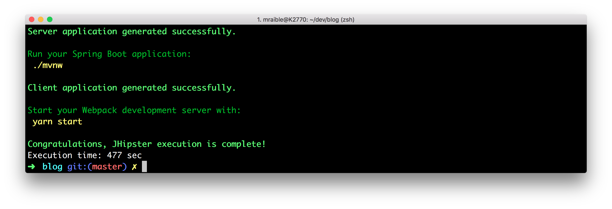
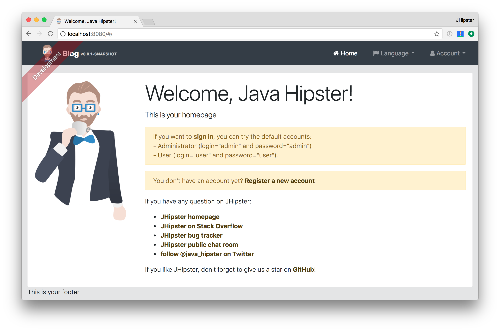

= What's New in JHipster 4

:author: Matt Raible
:email:  matt@raibledesigns.com
:revnumber: 1.0
:revdate:   {docdate}
:subject: JHipster
:keywords: JHipster, Angular, Spring Boot, Bootstrap 4
:icons: font
:lang: en
:language: javadocript
:sourcedir: .
ifndef::env-github[]
:icons: font
endif::[]
ifdef::env-github,env-browser[]
:toc: preamble
:toclevels: 2
endif::[]
ifdef::env-github[]
:status:
:outfilesuffix: .adoc
:!toc-title:
:caution-caption: :fire:
:important-caption: :exclamation:
:note-caption: :paperclip:
:tip-caption: :bulb:
:warning-caption: :warning:
endif::[]
:toc:

This article shows you how to build a simple blog application with https://jhipster.github.io/[JHipster] 4. At the time of this writing (January 10, 2017), JHipster 4 has not been released.

ifdef::env-github[]
TIP: It appears you're reading this document on GitHub. If you want a prettier view, install https://chrome.google.com/webstore/detail/asciidoctorjs-live-previe/iaalpfgpbocpdfblpnhhgllgbdbchmia[Asciidoctor.js Live Preview for Chrome], then view the https://raw.githubusercontent.com/mraible/jhipster4-demo/master/README.adoc[raw document]. Another option is to use the http://gist.asciidoctor.org/?github-mraible/jhipster4-demo//README.adoc[DocGist view].
endif::[]

.Source Code
****
If you'd like to get right to it, the https://github.com/mraible/jhipster4-demo[source is on GitHub]. To run the app, use `./mvnw`. To test it, run `./mvnw test`. To run its integration tests, run `./mvnw` in one terminal and `npm run e2e` in another.
****

== What is JHipster?

JHipster is one of those open-source projects you stumble upon and immediately think, "`Of course!`" It combines three very successful frameworks in web development: Bootstrap, AngularJS, and Spring Boot. Bootstrap was one of the first dominant web-component frameworks. Its largest appeal was that it only required a bit of HTML and it worked! All the efforts we made in the Java community to develop web components were shown a better path by Bootstrap. It leveled the playing field in HTML/CSS development, much like Apple's Human Interface Guidelines did for iOS apps.

JHipster was started by Julien Dubois in October 2013 (Julien's first commit was on https://github.com/jhipster/generator-jhipster/commit/c8630ab7af7b6a99db880b3b0e2403806b7d2436[October 21, 2013]). The first public release (version 0.3.1) was launched December 7, 2013. Since then, the project has had over 110 releases! It is an open-source, Apache 2.0-licensed project on GitHub. It has a core team of 16 developers and over 280 contributors. You can find its homepage at http://jhipster.github.io/[http://jhipster.github.io]. If you look at https://github.com/jhipster/generator-jhipster[the project on GitHub], you can see it's mostly written in JavaScript (42%) and Java (27%).

At its core, JHipster is a http://yeoman.io/[Yeoman] generator. Yeoman is a code generator that you run with a `yo` command to generate complete applications or useful pieces of an application. Yeoman generators promote what the Yeoman team calls the "`Yeoman workflow`". This is an opinionated client-side stack of tools that can help developers quickly build beautiful web applications. It takes care of providing everything needed to get working without the normal pains associated with a manual setup.

JHipster 4 is the same JHipster many developers know and love, with a couple bright and shiny new features: namely Angular 2 and Bootstrap 4 support.

NOTE: When I say "AngularJS", I mean Angular 1.x. "Angular" is the forward-looking name for Angular 2 and beyond.

== Get Started with JHipster 4

The http://jhipster.github.io/installation/[Installing JHipster] instructions show you all the tools you'll need to use a released version of JHipster. These instructions have not been updated for JHipster 4, so here's the abbreviated version.

. Install Java 8 http://www.oracle.com/technetwork/java/javase/downloads/index.html[from Oracle].
. Install Git from https://git-scm.com.
. Install Node.js from http://nodejs.org. I used Node 6.9.1 to write this article.
. Install Yarn from https://yarnpkg.com/en/docs/install[using the Yarn installation instructions].
. Run the following command to install http://yeoman.io/[Yeoman].

[source]
----
npm install -g yo
----

Since JHipster 4 is not released yet, you'll need to clone its GitHub repository to create a project with it.

----
git clone https://github.com/jhipster/generator-jhipster
----

After cloning it locally, you'll need to run `npm link` in the `generator-jhipster` directory so npm knows to use your local copy instead of trying to download and install it. You can also use `yarn link` if you'd prefer to use Yarn over npm.

== Create a Project

To create a project, open a terminal window and create a directory. For example, `mdkdir blog`. Navigate into the directory and run `yo jhipster`. You'll be asked a number of questions about the type of application you want to create and what features you'd like to include. The screenshot below shows the choices I made to create a simple blog application.

.Generating the application
image::static/generating-blog.png[Generating the application, 1082, scaledwidth=100%]

If you'd like to create a the same application I did, you can place the following `.yo-rc.json` file in an empty directory and run `yo jhipster` in it. You won't be prompted to answer any questions because the answers are already in `.yo-rc.json`.

[source,json]
----
{
  "generator-jhipster": {
    "jhipsterVersion": "3.12.2",
    "baseName": "blog",
    "packageName": "org.jhipster",
    "packageFolder": "org/jhipster",
    "serverPort": "8080",
    "authenticationType": "jwt",
    "hibernateCache": "ehcache",
    "clusteredHttpSession": false,
    "websocket": false,
    "databaseType": "sql",
    "devDatabaseType": "h2Disk",
    "prodDatabaseType": "postgresql",
    "searchEngine": false,
    "messageBroker": false,
    "buildTool": "maven",
    "enableSocialSignIn": false,
    "jwtSecretKey": "fac063fc9ee4dade2472173f04f4d19c4c434aba",
    "useSass": true,
    "clientPackageManager": "yarn",
    "applicationType": "monolith",
    "clientFramework": "angular2",
    "testFrameworks": [
      "gatling",
      "protractor"
    ],
    "jhiPrefix": "jhi",
    "enableTranslation": true,
    "nativeLanguage": "en",
    "languages": [
      "en",
      "es"
    ]
  }
}
----

The project creation process will take a couple minutes to run, depending on your internet connection speed. When it's finished, you should see output like the following.

.Generation success

Run `/.mvnw` to start the application and navigate to http://localhost:8080 in your favorite browser. The first thing you'll notice is a hip-looking guy explaining how you can sign in or register.

.Default homepage

Sign in with username **admin** and password **admin**, you can browser around through the Administration section. This section offers nice looking UIs on top of some Spring Boot's many monitoring and configuration features. It also allows you to administer users:

.User management
image::static/user-management.png[User management, 1437, scaledwidth=100%]

It gives you insights into Application and JVM metrics:

.Application metrics

And it allows you to see the Swagger docs associated with its API.

.Swagger docs
image::static/swagger-docs.png[Swagger docs, 1437, scaledwidth=100%]

== Generate Entities

== Add Business Logic

== Make UI Enhancements

== Deploy to the Cloud

== Learn More

About the Author: **Matt Raible** is a web developer and Java Champion. He loves to architect and build slick-looking UIs using CSS and JavaScript. When he's not evangelizing https://stormpath.com[Stormpath] and open source, he likes to ski with his family, drive his VWs and enjoy craft beer. He blogs on https://stormpath.com/blog[stormpath.com/blog], his https://raibledesigns.com/[personal blog], and you can find him on Twitter (https://twitter.com/mraible[@mraible]). He also authors the https://www.infoq.com/minibooks/jhipster-2-mini-book[JHipster Mini-Book] for InfoQ.
